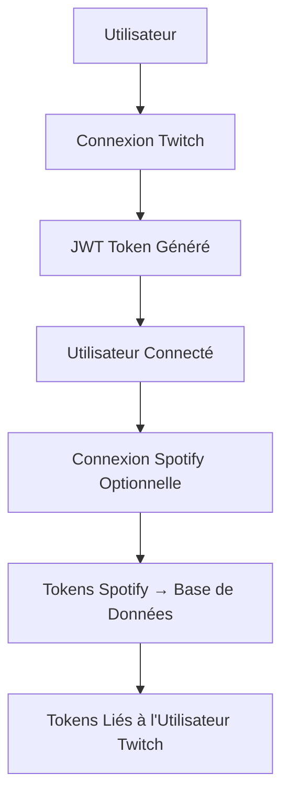

# Guide Déploiement Multi-Utilisateurs

## 🎯 **Architecture Multi-Utilisateurs Complète**

L'application **Le Vinyle** supporte maintenant une **gestion multi-utilisateurs complète** :

- **🎮 Twitch** = Authentification principale (JWT unique par utilisateur)
- **🎵 Spotify** = Tokens individuels stockés en base de données
- **🔐 Sécurité** = Isolation complète entre utilisateurs
- **📊 Persistance** = Tokens survivent aux redémarrages serveur

## 🚀 **Déploiement sur Render.com**

### **1. Migration de Base de Données**

**Sur votre machine locale :**
```bash
# Appliquer la migration multi-utilisateurs
cd backend
node scripts/migrate-multi-users.js
```

**Sur Render.com (via Shell) :**
```bash
# Se connecter au shell PostgreSQL
psql $DATABASE_URL

# Appliquer la migration manuellement
\i backend/db/add_spotify_tokens.sql

# Vérifier la migration
\d users
```

### **2. Variables d'Environnement Render**

**Service Backend :**
```env
# Base de données (automatique sur Render)
DATABASE_URL=postgresql://...

# Sécurité
JWT_SECRET=your-super-secret-jwt-key
SESSION_SECRET=your-super-secret-session-key

# Frontend URL
FRONTEND_URL=https://levinyle-frontend.onrender.com

# Twitch OAuth
TWITCH_CLIENT_ID=your_twitch_client_id
TWITCH_CLIENT_SECRET=your_twitch_client_secret
TWITCH_REDIRECT_URI=https://levinyle-backend.onrender.com/api/auth/twitch/callback

# Spotify OAuth
SPOTIFY_CLIENT_ID=your_spotify_client_id
SPOTIFY_CLIENT_SECRET=your_spotify_client_secret
SPOTIFY_REDIRECT_URI=https://levinyle-backend.onrender.com/api/auth/spotify/callback
```

**Service Frontend :**
```env
VITE_API_URL=https://levinyle-backend.onrender.com/api
```

### **3. Configuration OAuth**

**Twitch Developer Console :**
- **Redirect URI**: `https://levinyle-backend.onrender.com/api/auth/twitch/callback`

**Spotify Developer Dashboard :**
- **Redirect URI**: `https://levinyle-backend.onrender.com/api/auth/spotify/callback`

## 🏗️ **Architecture Technique**

### **Flux d'Authentification**



### **Structure Base de Données**

**Table `users` (Améliorée) :**
```sql
CREATE TABLE users (
    id VARCHAR(255) PRIMARY KEY,                -- ID Twitch
    display_name VARCHAR(255) NOT NULL,         -- Nom d'affichage Twitch
    email VARCHAR(255),                         -- Email Twitch
    role VARCHAR(50) DEFAULT 'viewer',          -- Rôle dans l'app
    is_streamer BOOLEAN DEFAULT FALSE,          -- Peut créer des sessions
    profile_picture VARCHAR(512),               -- Photo de profil Twitch
    
    -- Informations Spotify (NOUVEAU)
    spotify_id VARCHAR(255),                    -- ID Spotify
    spotify_display_name VARCHAR(255),          -- Nom d'affichage Spotify
    spotify_profile_picture VARCHAR(512),       -- Photo de profil Spotify
    spotify_access_token TEXT,                  -- Token d'accès Spotify
    spotify_refresh_token TEXT,                 -- Token de rafraîchissement
    spotify_token_expires_at TIMESTAMP,         -- Expiration du token
    spotify_connected_at TIMESTAMP,             -- Date de connexion Spotify
    
    created_at TIMESTAMP DEFAULT CURRENT_TIMESTAMP,
    updated_at TIMESTAMP DEFAULT CURRENT_TIMESTAMP
);
```

## 🔄 **Fonctionnement Multi-Utilisateurs**

### **Scénario 1 : Utilisateur A se connecte**
1. **Twitch Auth** → JWT généré avec ID utilisateur A
2. **Spotify Auth** → Tokens stockés en DB liés à l'utilisateur A
3. **API Calls** → Utilisent les tokens de l'utilisateur A uniquement

### **Scénario 2 : Utilisateur B se connecte en parallèle**
1. **Twitch Auth** → JWT généré avec ID utilisateur B (différent)
2. **Spotify Auth** → Tokens stockés en DB liés à l'utilisateur B
3. **Isolation complète** → A et B voient chacun leurs propres playlists

### **Scénario 3 : Redémarrage serveur**
1. **Variables globales** → Vides (plus de problème !)
2. **Tokens en DB** → Persistent et sont rechargés à la demande
3. **Utilisateurs** → Restent connectés sans interruption

## 🛡️ **Sécurité et Isolation**

### **Avant (Problématique) :**
```javascript
// ❌ Variables globales partagées
let spotifyUserTokens = { 
  user1: { tokens... },
  user2: { tokens... }  // Tous voient les mêmes tokens !
};
```

### **Maintenant (Sécurisé) :**
```javascript
// ✅ Tokens isolés par utilisateur
const tokens = await User.getSpotifyTokens(req.user.id); // Chaque utilisateur = ses tokens
```

## 📱 **Endpoints API Mis à Jour**

### **Authentification**
- `GET /api/auth/spotify` → Lie au compte Twitch si connecté
- `GET /api/auth/spotify/status` → Statut de l'utilisateur connecté
- `POST /api/auth/spotify/logout` → Déconnecte l'utilisateur connecté

### **Spotify (Protégés par JWT)**
- `GET /api/spotify/playlists` → Playlists de l'utilisateur connecté
- `POST /api/spotify/playlists/:id/tracks` → Utilise les tokens de l'utilisateur

### **Sessions & Propositions (Inchangées)**
- Fonctionnent avec les tokens Spotify de l'utilisateur qui modère

## 🧪 **Tests Multi-Utilisateurs**

### **Test 1 : Isolation des Comptes**
```bash
# Utilisateur A se connecte à Spotify
curl -H "Authorization: Bearer <jwt_user_a>" \
     https://levinyle-backend.onrender.com/api/auth/spotify/status

# Utilisateur B se connecte à Spotify  
curl -H "Authorization: Bearer <jwt_user_b>" \
     https://levinyle-backend.onrender.com/api/auth/spotify/status

# Résultat : Chaque utilisateur voit SES propres données Spotify
```

### **Test 2 : Persistance après Redémarrage**
```bash
# Avant redémarrage : Utilisateur A connecté à Spotify
# Redémarrage du serveur Render
# Après redémarrage : Utilisateur A toujours connecté (tokens en DB)
```

### **Test 3 : Sessions Parallèles**
1. **Utilisateur A** : Crée session "SessionA"
2. **Utilisateur B** : Crée session "SessionB"  
3. **Modération** : Chacun modère avec ses propres playlists Spotify

## 🚨 **Migration depuis l'Ancien Système**

### **Impact utilisateurs :**
- **Connexions Twitch** : Inchangées ✅
- **Connexions Spotify** : Doivent se reconnecter une fois ⚠️
- **Sessions existantes** : Fonctionnent normalement ✅
- **Propositions** : Aucun impact ✅

### **Étapes de migration :**
1. **Appliquer la migration DB** (ajoute les colonnes)
2. **Redéployer le backend** (nouveau code multi-users)
3. **Redéployer le frontend** (si modifications API)
4. **Informer les utilisateurs** de se reconnecter à Spotify

## 📊 **Monitoring et Debug**

### **Logs utiles :**
```javascript
// Connexion utilisateur
"✅ Utilisateur Twitch identifié: <user_id> <display_name>"

// Liaison Spotify
"✅ Tokens Spotify liés au compte Twitch: <user_id>"

// Isolation vérifiée  
"🔍 Vérification statut Spotify pour utilisateur: <user_id>"
```

### **Endpoints de debug :**
```bash
# Vérifier les tokens d'un utilisateur (nécessite JWT)
GET /api/auth/spotify/status

# Statistiques générales
GET /api/health
```

## 🎯 **Avantages de l'Architecture**

### **✅ Pour les Utilisateurs :**
- Isolation complète des comptes
- Playlists personnelles
- Pas d'interférences entre utilisateurs
- Persistance des connexions

### **✅ Pour les Développeurs :**
- Code plus propre et sécurisé
- Gestion centralisée des tokens
- Possibilité de révocation/gestion fine
- Monitoring per-utilisateur

### **✅ Pour la Production :**
- Scalabilité améliorée
- Support multi-tenants natif  
- Base solide pour fonctionnalités avancées
- Conformité sécurité renforcée

## 🔧 **Script de Migration Rapide**

```bash
# Commande complète pour migrer
cd backend
node scripts/migrate-multi-users.js && npm run dev
```

---

**🎉 L'architecture multi-utilisateurs est maintenant complètement opérationnelle !**

Chaque utilisateur a ses propres tokens Spotify isolés, stockés en base de données, avec une sécurité renforcée et une persistance garantie. 